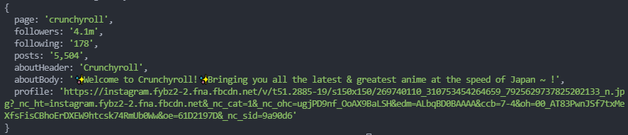

# Instagram-Scraper

Scraper.js contains a function which utilises the puppeteer package to grab data on a given instagram page. We retrieve and log to the console, the page name, followers, following count, posts, about section text, and a profile picture link.
Note this only works for public pages and not for private pages.

For example we can scrape crunchyrolls IG page which returns this data:

